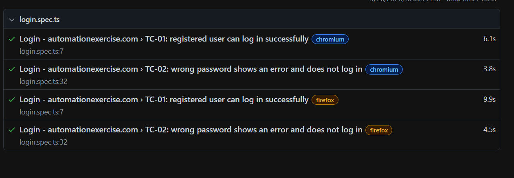

# Automation Exercise – Login Automation (Playwright + TypeScript)

Automates the login flow on https://www.automationexercise.com/ using Playwright with the Page Object Model.

## Scenario covered
| ID | Test | Steps |
|----|------|-------|
| TC-01 | Successful login | Launch site, go to Signup / Login, enter registered email and password, submit, verify "Logged in as <name>" and Logout link are visible |
| TC-02 | Invalid password (negative) | Same flow with wrong password, verify error "Your email or password is incorrect!" and user is not logged in |

## Tech stack
- Playwright Test (TypeScript)
- Page Object Model (`pages/`)
- dotenv for credentials (never hard-coded)
- HTML report, screenshots, video and trace on failure
- GitHub Actions CI (`.github/workflows/playwright.yml`)

## Project structure
```
pages/
  HomePage.ts        # home page actions, consent popup, "Logged in as" locator
  LoginPage.ts       # login form actions and error message
tests/
  login.spec.ts      # test cases
utils/
  env.ts             # loads and validates credentials from .env
playwright.config.ts
.env.example
```

## Prerequisites
- Node.js 18 or newer
- A user account created manually on https://www.automationexercise.com/ (Signup / Login > New User Signup)

## Setup
```bash
git clone <this-repo-url>
cd automationexercise-login
npm install
npx playwright install
cp .env.example .env     # Windows: copy .env.example .env
```
Edit `.env` with your account's email, password and signup name.

## Run
```bash
npm test                  # all browsers, headless
npm run test:headed       # watch the browser
npm run test:chrome       # Chromium only
npm run report            # open the HTML report
```

## CI
Add repository secrets `USER_EMAIL`, `USER_PASSWORD`, `USER_NAME` (Settings > Secrets and variables > Actions). Tests run on every push to `main` and the HTML report is uploaded as a build artifact.

## Notes
- The site shows ads and, in some regions, a cookie consent dialog. `HomePage.dismissConsentIfShown()` handles the dialog.
- Locators use the site's `data-qa` attributes for stability.

## Test Report
 


